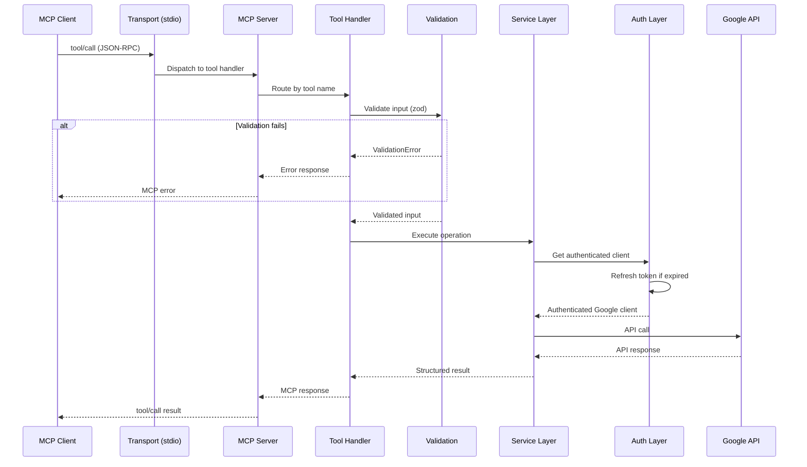
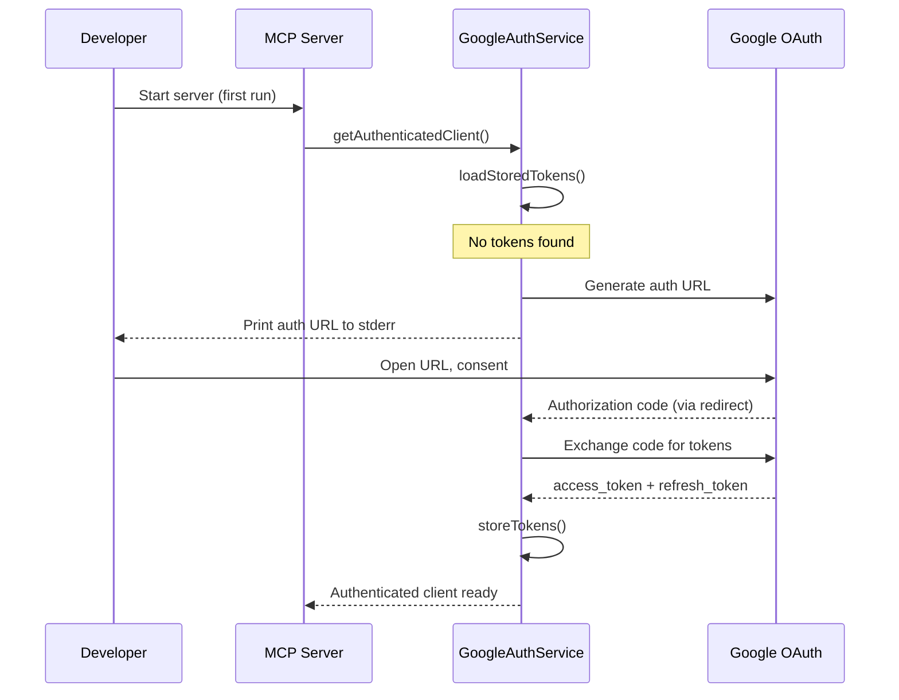
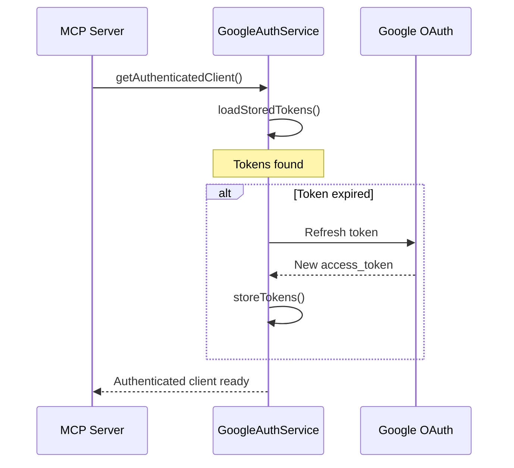
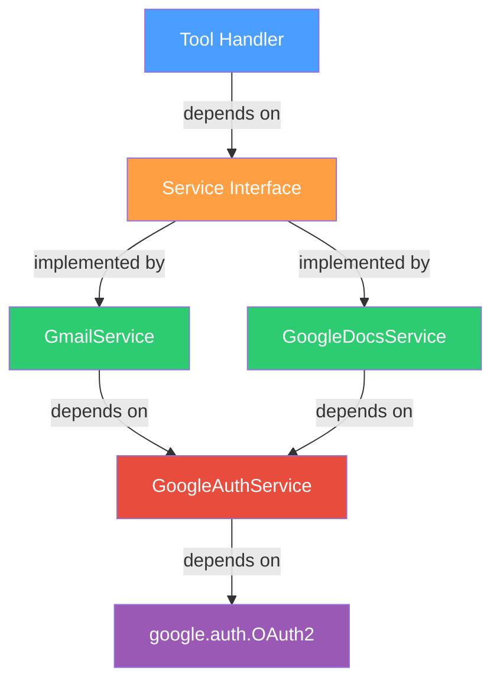

# Architecture: Generic Gmail + Google Docs MCP Server

> Derived from [problemStatementmcp.md](file:///Users/shaguftagurmukhdas/Downloads/mcpserver/docs/problemStatementmcp.md)

---

## 1. Overview

This document describes the architecture for a **generic, reusable MCP (Model Context Protocol) server** that exposes Gmail and Google Docs capabilities as discoverable tools to any MCP-compatible AI agent.

### Goals

| Goal | Description |
|------|-------------|
| **Generic** | Framework/agent agnostic — any MCP client can connect |
| **Secure** | OAuth 2.0 with least-privilege scopes, no secrets in code or logs |
| **Extensible** | Adding new Google services (Calendar, Sheets, Drive) requires only a new tool + service — no core changes |
| **Reliable** | Google API failures never crash the server; errors are actionable |
| **Testable** | All layers independently testable with mocked Google APIs |

### Tools Exposed

| Tool | Description | Side Effect |
|------|-------------|-------------|
| `gmail_create_draft` | Creates a Gmail draft | None (safe) |
| `gmail_send_email` | Sends an email via Gmail | **External** — sends real email |
| `google_docs_append` | Appends content to an existing Google Doc | Modifies document |

---

## 2. Technology Stack

| Concern | Choice | Rationale |
|---------|--------|-----------|
| **Language** | TypeScript (Node.js) | First-class MCP SDK support, mature Google API clients, strong typing |
| **MCP SDK** | `@modelcontextprotocol/sdk` | Official MCP SDK for TypeScript |
| **Google APIs** | `googleapis` (official Node.js client) | Maintained by Google, full API coverage |
| **Transport** | stdio (primary), HTTP/SSE (future) | stdio is the standard for local MCP; architecture decouples transport from logic |
| **Validation** | `zod` | Runtime schema validation with TypeScript inference |
| **Logging** | `pino` | Structured JSON logging, redaction support for secrets |
| **Config** | `dotenv` + environment variables | Simple, 12-factor compliant |
| **Testing** | `vitest` | Fast, TypeScript-native, compatible with mocking |
| **Package Manager** | `npm` | Standard, widely supported |

---

## 3. High-Level Architecture

```
┌──────────────────────────────────────────────────────────┐
│                     MCP Client (AI Agent)                │
│              (Claude, Gemini, GPT, custom, …)            │
└────────────────────────┬─────────────────────────────────┘
                         │  MCP Protocol (stdio / HTTP)
                         ▼
┌──────────────────────────────────────────────────────────┐
│                     TRANSPORT LAYER                      │
│               stdio  │  HTTP/SSE (future)                │
└────────────────────────┬─────────────────────────────────┘
                         │
                         ▼
┌──────────────────────────────────────────────────────────┐
│                      MCP SERVER LAYER                    │
│                                                          │
│  ┌─────────────────┐  ┌──────────────────────────────┐   │
│  │  Tool Registry  │  │  Tool Definitions & Schemas  │   │
│  └────────┬────────┘  └──────────────┬───────────────┘   │
│           │                          │                    │
│           ▼                          ▼                    │
│  ┌──────────────────────────────────────────────────┐    │
│  │              TOOL HANDLERS                        │    │
│  │  gmail_create_draft  │  gmail_send_email          │    │
│  │  google_docs_append                               │    │
│  └──────────────────────┬───────────────────────────┘    │
└─────────────────────────┼────────────────────────────────┘
                          │
                          ▼
┌──────────────────────────────────────────────────────────┐
│                    VALIDATION LAYER                       │
│          zod schemas · email validation · limits          │
└─────────────────────────┬────────────────────────────────┘
                          │
                          ▼
┌──────────────────────────────────────────────────────────┐
│                     SERVICE LAYER                         │
│                                                          │
│  ┌────────────────┐ ┌──────────────────┐                 │
│  │  GmailService  │ │ GoogleDocsService│                 │
│  └───────┬────────┘ └────────┬─────────┘                 │
│          │                   │                            │
└──────────┼───────────────────┼────────────────────────────┘
           │                   │
           ▼                   ▼
┌──────────────────────────────────────────────────────────┐
│                  AUTHENTICATION LAYER                     │
│                                                          │
│  ┌─────────────────────────────────────────────────┐     │
│  │              GoogleAuthService                   │     │
│  │  OAuth 2.0 flow · token storage · auto-refresh  │     │
│  └──────────────────────┬──────────────────────────┘     │
└─────────────────────────┼────────────────────────────────┘
                          │
                          ▼
┌──────────────────────────────────────────────────────────┐
│                    GOOGLE APIs                            │
│           Gmail API  ·  Google Docs API                   │
└──────────────────────────────────────────────────────────┘
```

### Data Flow (Request Lifecycle)



---

## 4. Directory Structure

```
mcp-google-server/
│
├── src/
│   ├── index.ts                    # Entry point — bootstraps server
│   │
│   ├── server/
│   │   ├── mcp-server.ts           # MCP server setup & lifecycle
│   │   └── tool-registry.ts        # Registers all tools with the MCP SDK
│   │
│   ├── tools/
│   │   ├── gmail/
│   │   │   ├── create-draft.tool.ts    # gmail_create_draft handler
│   │   │   ├── send-email.tool.ts      # gmail_send_email handler
│   │   │   └── schemas.ts              # Zod schemas for Gmail tools
│   │   │
│   │   └── google-docs/
│   │       ├── append-content.tool.ts  # google_docs_append handler
│   │       └── schemas.ts              # Zod schemas for Docs tools
│   │
│   ├── services/
│   │   ├── gmail.service.ts        # Gmail API wrapper
│   │   ├── google-docs.service.ts  # Google Docs API wrapper
│   │   └── google-auth.service.ts  # OAuth 2.0 management
│   │
│   ├── validation/
│   │   ├── email.validator.ts      # Email address validation
│   │   └── common.validator.ts     # Shared validation utilities
│   │
│   ├── errors/
│   │   ├── error-codes.ts          # Enumerated error codes
│   │   ├── mcp-error.ts            # Custom MCP-aware error class
│   │   └── error-handler.ts        # Google API → MCP error translation
│   │
│   ├── logging/
│   │   └── logger.ts               # Pino logger with redaction
│   │
│   ├── config/
│   │   └── config.ts               # Environment config loader
│   │
│   └── types/
│       ├── gmail.types.ts          # Gmail-specific TypeScript types
│       ├── google-docs.types.ts    # Google Docs-specific types
│       └── mcp.types.ts            # Shared MCP response types
│
├── tests/
│   ├── unit/
│   │   ├── tools/
│   │   │   ├── gmail-create-draft.test.ts
│   │   │   ├── gmail-send-email.test.ts
│   │   │   └── google-docs-append.test.ts
│   │   ├── services/
│   │   │   ├── gmail.service.test.ts
│   │   │   ├── google-docs.service.test.ts
│   │   │   └── google-auth.service.test.ts
│   │   └── validation/
│   │       └── email.validator.test.ts
│   │
│   ├── integration/
│   │   ├── mcp-server.test.ts      # End-to-end MCP tool calls with mocks
│   │   └── google-api.test.ts      # Real API tests (opt-in, requires creds)
│   │
│   └── mocks/
│       ├── gmail-api.mock.ts
│       └── google-docs-api.mock.ts
│
├── .env.example
├── .gitignore
├── tsconfig.json
├── package.json
├── vitest.config.ts
├── README.md
└── docs/
    ├── problemStatementmcp.md
    └── architecture.md             # ← This document
```

---

## 5. Module Design

### 5.1 Transport Layer

| Responsibility | Details |
|----------------|---------|
| Protocol handling | Parses JSON-RPC messages over stdio |
| Decoupled from logic | Tool/service layers have zero knowledge of transport |
| Future-proofing | HTTP/SSE can be added as an alternative transport without touching tool code |

**Implementation**: Use the `StdioServerTransport` from `@modelcontextprotocol/sdk/server/stdio`.

```typescript
// src/index.ts (conceptual)
import { StdioServerTransport } from "@modelcontextprotocol/sdk/server/stdio.js";
import { createMcpServer } from "./server/mcp-server.js";

const server = createMcpServer();
const transport = new StdioServerTransport();
await server.connect(transport);
```

---

### 5.2 MCP Server Layer

| File | Responsibility |
|------|----------------|
| `mcp-server.ts` | Creates `McpServer` instance, sets server name/version, connects to transport |
| `tool-registry.ts` | Registers each tool with its name, description, input schema (zod), and handler callback |

**Tool Registration Pattern**:

```typescript
// src/server/tool-registry.ts (conceptual)
import { McpServer } from "@modelcontextprotocol/sdk/server/mcp.js";

export function registerTools(server: McpServer): void {
  server.tool(
    "gmail_create_draft",
    "Create a Gmail draft. This does not send the email.",
    GmailDraftInputSchema,    // zod schema
    handleCreateDraft         // handler function
  );
  // ... register other tools
}
```

> [!IMPORTANT]
> Tool descriptions must clearly communicate side effects. `gmail_send_email` must state it **sends the email immediately**.

---

### 5.3 Tool Handlers

Each tool handler is a thin function that:

1. **Receives** validated input from the MCP SDK
2. **Delegates** to the appropriate service
3. **Returns** a structured MCP response

Tool handlers must **not** contain:
- Google API calls directly
- Authentication logic
- Complex business logic

```typescript
// src/tools/gmail/create-draft.tool.ts (conceptual)
export async function handleCreateDraft(args: GmailDraftInput): Promise<McpToolResponse> {
  const result = await gmailService.createDraft(args);
  return {
    content: [{ type: "text", text: JSON.stringify(result) }]
  };
}
```

---

### 5.4 Validation Layer

| Validator | Validates |
|-----------|-----------|
| `email.validator.ts` | RFC 5322 email addresses, array of emails |
| `common.validator.ts` | Non-empty strings, document IDs, body length limits |

Validation is implemented as **zod schemas** with custom refinements:

```typescript
// src/tools/gmail/schemas.ts (conceptual)
import { z } from "zod";
import { emailArraySchema } from "../../validation/email.validator.js";

export const GmailDraftInputSchema = z.object({
  to: emailArraySchema.min(1, "At least one recipient required"),
  cc: emailArraySchema.optional().default([]),
  bcc: emailArraySchema.optional().default([]),
  subject: z.string().min(1, "Subject is required"),
  body: z.string().min(1, "Body is required"),
  body_type: z.enum(["plain", "html"]).optional().default("plain"),
});
```

> [!NOTE]
> Zod schemas serve double-duty: they define both the MCP input schema (via `zodToJsonSchema`) and the runtime validation logic.

---

### 5.5 Service Layer

Each service encapsulates **all Google API interaction** for its domain.

#### GmailService

| Method | Google API Call | Returns |
|--------|----------------|---------|
| `createDraft(input)` | `gmail.users.drafts.create` | `{ success, draft_id, message }` |
| `sendEmail(input)` | `gmail.users.messages.send` | `{ success, message_id, thread_id, message }` |

Internal responsibilities:
- Construct RFC 2822 MIME messages (with `to`, `cc`, `bcc`, `subject`, `body`)
- Encode messages as base64url
- Handle `plain` vs `html` content types

#### GoogleDocsService

| Method | Google API Calls | Returns |
|--------|------------------|---------|
| `appendContent(input)` | `docs.documents.get` → `docs.documents.batchUpdate` | `{ success, document_id, message }` |

Internal responsibilities:
- Fetch current document to determine the end-of-body insertion index
- Handle the Google Docs structural model (the last character is always `\n` at `endIndex - 1`)
- Construct an `insertText` request at the correct index
- Preserve all existing content

#### GoogleAuthService

| Method | Description |
|--------|-------------|
| `getAuthenticatedClient()` | Returns an authorized `google.auth.OAuth2` client |
| `authorize()` | Runs the OAuth consent flow (first-time setup) |
| `refreshToken()` | Silently refreshes an expired access token |
| `loadStoredTokens()` | Reads tokens from the configured storage path |
| `storeTokens(tokens)` | Persists tokens to the configured storage path |

```
┌──────────────────────────────┐
│      GoogleAuthService       │
│                              │
│  ┌────────────────────────┐  │
│  │  OAuth2Client          │  │
│  │  (googleapis)          │  │
│  └────────┬───────────────┘  │
│           │                  │
│  ┌────────▼───────────────┐  │
│  │  Token Storage         │  │
│  │  (file-based / env)    │  │
│  └────────────────────────┘  │
└──────────────────────────────┘
```

> [!TIP]
> Services receive the `GoogleAuthService` via **constructor injection**, making them independently testable with mock auth clients.

---

### 5.6 Error Handling

#### Error Code Taxonomy

```typescript
// src/errors/error-codes.ts
export enum ErrorCode {
  // Authentication
  AUTHENTICATION_REQUIRED = "AUTHENTICATION_REQUIRED",
  TOKEN_EXPIRED           = "TOKEN_EXPIRED",
  PERMISSION_DENIED       = "PERMISSION_DENIED",

  // Validation
  INVALID_INPUT           = "INVALID_INPUT",
  INVALID_EMAIL           = "INVALID_EMAIL",
  MISSING_REQUIRED_FIELD  = "MISSING_REQUIRED_FIELD",

  // Google API
  DOCUMENT_NOT_FOUND      = "DOCUMENT_NOT_FOUND",
  INVALID_DOCUMENT        = "INVALID_DOCUMENT",
  RATE_LIMITED             = "RATE_LIMITED",
  GOOGLE_API_ERROR        = "GOOGLE_API_ERROR",

  // Internal
  INTERNAL_ERROR          = "INTERNAL_ERROR",
}
```

#### Error Translation Pipeline

```
Google API Error (GaxiosError)
        │
        ▼
┌───────────────────────┐
│    error-handler.ts   │
│                       │
│  HTTP 401 → TOKEN_EXPIRED / AUTHENTICATION_REQUIRED
│  HTTP 403 → PERMISSION_DENIED
│  HTTP 404 → DOCUMENT_NOT_FOUND
│  HTTP 429 → RATE_LIMITED
│  Other   → GOOGLE_API_ERROR
└───────────┬───────────┘
            │
            ▼
    McpError (custom class)
    {
      success: false,
      error: {
        code: "DOCUMENT_NOT_FOUND",
        message: "The specified Google Doc could not be found or accessed."
      }
    }
```

> [!CAUTION]
> Raw Google API stack traces and error details must **never** be exposed to MCP clients. They are logged server-side only.

---

### 5.7 Logging

**Logger**: `pino` with structured JSON output.

| Field | Description |
|-------|-------------|
| `timestamp` | ISO 8601 timestamp |
| `level` | Log level (`info`, `warn`, `error`, `debug`) |
| `tool_name` | MCP tool that was invoked |
| `operation` | Internal operation name |
| `success` | Boolean outcome |
| `error_code` | Error code if applicable |
| `request_id` | Correlation ID for tracing |
| `duration_ms` | Operation duration |

**Redaction rules** (configured in pino):

```typescript
redact: [
  "access_token", "refresh_token", "client_secret",
  "body", "content", "email_body"
]
```

---

### 5.8 Configuration

All configuration is loaded from environment variables via `dotenv`.

```env
# .env.example

# Google OAuth 2.0
GOOGLE_CLIENT_ID=
GOOGLE_CLIENT_SECRET=
GOOGLE_REDIRECT_URI=http://localhost:3000/oauth/callback
GOOGLE_TOKEN_PATH=./tokens.json

# Logging
LOG_LEVEL=info

# Server
MCP_SERVER_NAME=mcp-google-server
MCP_SERVER_VERSION=1.0.0
```

The `config.ts` module validates that all required variables are present at startup and fails fast with a clear error if any are missing.

---

## 6. Authentication Flow

### First-Time Authorization



### Subsequent Runs (Token Refresh)



### OAuth Scopes

| Scope | Purpose |
|-------|---------|
| `https://www.googleapis.com/auth/gmail.compose` | Create drafts |
| `https://www.googleapis.com/auth/gmail.send` | Send emails |
| `https://www.googleapis.com/auth/documents` | Read + write Google Docs |

> [!IMPORTANT]
> These are the **least-privilege** scopes required. Do not request broader scopes (e.g., `gmail.modify` or `gmail.readonly`) unless explicitly needed in a future version.

---

## 7. MCP Tool Schemas

### gmail_create_draft

```json
{
  "name": "gmail_create_draft",
  "description": "Create a Gmail draft using the authenticated Google account. This does NOT send the email.",
  "inputSchema": {
    "type": "object",
    "properties": {
      "to":        { "type": "array", "items": { "type": "string" }, "description": "Recipient email addresses" },
      "cc":        { "type": "array", "items": { "type": "string" }, "description": "CC email addresses" },
      "bcc":       { "type": "array", "items": { "type": "string" }, "description": "BCC email addresses" },
      "subject":   { "type": "string", "description": "Email subject line" },
      "body":      { "type": "string", "description": "Email body content" },
      "body_type": { "type": "string", "enum": ["plain", "html"], "description": "Body content type" }
    },
    "required": ["to", "subject", "body"]
  }
}
```

### gmail_send_email

```json
{
  "name": "gmail_send_email",
  "description": "Send an email immediately using Gmail. WARNING: This performs an external side effect — the email will be sent.",
  "inputSchema": {
    "type": "object",
    "properties": {
      "to":        { "type": "array", "items": { "type": "string" }, "description": "Recipient email addresses" },
      "cc":        { "type": "array", "items": { "type": "string" }, "description": "CC email addresses" },
      "bcc":       { "type": "array", "items": { "type": "string" }, "description": "BCC email addresses" },
      "subject":   { "type": "string", "description": "Email subject line" },
      "body":      { "type": "string", "description": "Email body content" },
      "body_type": { "type": "string", "enum": ["plain", "html"], "description": "Body content type" }
    },
    "required": ["to", "subject", "body"]
  }
}
```

### google_docs_append

```json
{
  "name": "google_docs_append",
  "description": "Append text content to the end of an existing Google Doc. Existing content is preserved.",
  "inputSchema": {
    "type": "object",
    "properties": {
      "document_id": { "type": "string", "description": "The Google Docs document ID" },
      "content":     { "type": "string", "description": "Text content to append" },
      "add_newline": { "type": "boolean", "description": "Whether to prepend a newline before the appended content" }
    },
    "required": ["document_id", "content"]
  }
}
```

---

## 8. Response Contracts

All tool responses follow a consistent structure:

### Success

```json
{
  "success": true,
  "<resource_id_field>": "<id>",
  "message": "Human-readable success message."
}
```

### Error

```json
{
  "success": false,
  "error": {
    "code": "ERROR_CODE",
    "message": "Human-readable, actionable error description."
  }
}
```

Both are returned as `text` content within the MCP tool response:

```typescript
{
  content: [{ type: "text", text: JSON.stringify(response) }]
}
```

---

## 9. Dependency Injection & Testability



Services are constructed with their dependencies injected, enabling:

- **Unit tests**: Inject mock auth/API clients
- **Integration tests**: Inject real clients pointing at test accounts
- **Future multi-user**: Inject per-request auth clients

```typescript
// Construction
const authService = new GoogleAuthService(config);
const gmailService = new GmailService(authService);
const docsService = new GoogleDocsService(authService);

// Testing
const mockAuth = new MockGoogleAuthService();
const gmailService = new GmailService(mockAuth);
```

---

## 10. Testing Strategy

### Test Pyramid

```
        ╱╲
       ╱  ╲         Integration Tests
      ╱ IT ╲        MCP server end-to-end with mocked Google APIs
     ╱──────╲
    ╱        ╲       Unit Tests
   ╱   Unit   ╲     Validators, services, error translation, tool handlers
  ╱────────────╲
 ╱              ╲    (Optional) Real API Tests
╱   Real API     ╲   Opt-in, require credentials, run separately
╱────────────────────╲
```

### Unit Tests

| Target | What's Tested |
|--------|---------------|
| Email validator | Valid/invalid email formats, edge cases |
| Gmail schemas | Required fields, optional defaults, enum validation |
| Docs schemas | Document ID format, content requirements |
| GmailService | MIME message construction, base64url encoding |
| GoogleDocsService | Insertion index calculation, request construction |
| Error handler | HTTP status → error code mapping |

### Integration Tests

| Target | What's Tested |
|--------|---------------|
| MCP server | Full tool call cycle through stdio with mocked Google APIs |
| Tool discovery | All tools are listed with correct schemas |
| Error propagation | Google API errors surface as proper MCP errors |

### Real API Tests (Opt-in)

Marked with a special test tag (e.g., `@real-api`). Require a configured `.env` with valid credentials. **Not run in CI by default.**

---

## 11. Security Considerations

| Concern | Mitigation |
|---------|------------|
| Secrets in code | All credentials via env vars; `.env` in `.gitignore` |
| Secrets in logs | Pino redaction of `access_token`, `refresh_token`, `client_secret` |
| Secrets in MCP responses | Error handler strips raw API details |
| OAuth scope creep | Explicitly request only the 3 required scopes |
| Input injection | Zod validation on all inputs; email format enforcement |
| HTML body risks | Document that HTML bodies are passed as-is to Gmail; server does not sanitize (agent responsibility) |
| Token storage | File-system storage with restrictive permissions; path configurable |

---

## 12. Extensibility Model

Adding a new Google service (e.g., Google Calendar) follows this pattern:

```
1. Create src/tools/google-calendar/
   ├── create-event.tool.ts      # Tool handler
   └── schemas.ts                # Zod input schema

2. Create src/services/google-calendar.service.ts
   - Wraps the Google Calendar API
   - Depends on GoogleAuthService

3. Register the tool in tool-registry.ts

4. Add the required OAuth scope to config

5. Add tests in tests/unit/tools/ and tests/unit/services/
```

No changes are needed to:
- `mcp-server.ts`
- `google-auth.service.ts` (just add the scope)
- Any existing tool or service
- The transport layer

---

## 13. Phased Implementation Plan

### Phase 1 — Foundation

| Task | Files |
|------|-------|
| Project scaffolding (`npm init`, tsconfig, vitest) | `package.json`, `tsconfig.json`, `vitest.config.ts` |
| Configuration module | `src/config/config.ts` |
| Logger setup | `src/logging/logger.ts` |
| Error codes & custom error class | `src/errors/*` |
| `.env.example` and `.gitignore` | Root files |

### Phase 2 — Authentication

| Task | Files |
|------|-------|
| GoogleAuthService (OAuth flow, token storage, refresh) | `src/services/google-auth.service.ts` |
| Auth unit tests | `tests/unit/services/google-auth.service.test.ts` |
| Manual auth flow verification | CLI-based OAuth consent |

### Phase 3 — MCP Server Core

| Task | Files |
|------|-------|
| MCP server bootstrap | `src/server/mcp-server.ts`, `src/index.ts` |
| Tool registry framework | `src/server/tool-registry.ts` |
| Shared types | `src/types/*` |
| Server integration test (empty server starts) | `tests/integration/mcp-server.test.ts` |

### Phase 4 — Gmail Tools

| Task | Files |
|------|-------|
| Validation schemas | `src/tools/gmail/schemas.ts`, `src/validation/email.validator.ts` |
| GmailService | `src/services/gmail.service.ts` |
| `gmail_create_draft` tool handler | `src/tools/gmail/create-draft.tool.ts` |
| `gmail_send_email` tool handler | `src/tools/gmail/send-email.tool.ts` |
| Gmail unit tests | `tests/unit/tools/gmail-*.test.ts`, `tests/unit/services/gmail.service.test.ts` |
| Gmail mock | `tests/mocks/gmail-api.mock.ts` |

### Phase 5 — Google Docs Tool

| Task | Files |
|------|-------|
| Validation schemas | `src/tools/google-docs/schemas.ts` |
| GoogleDocsService | `src/services/google-docs.service.ts` |
| `google_docs_append` tool handler | `src/tools/google-docs/append-content.tool.ts` |
| Docs unit tests | `tests/unit/tools/google-docs-append.test.ts`, `tests/unit/services/google-docs.service.test.ts` |
| Docs mock | `tests/mocks/google-docs-api.mock.ts` |

### Phase 6 — Integration & Polish

| Task | Files |
|------|-------|
| Full MCP integration tests | `tests/integration/mcp-server.test.ts` |
| README.md | `README.md` |
| Real API test suite (opt-in) | `tests/integration/google-api.test.ts` |
| End-to-end manual testing with an MCP client | — |

---

## 14. Key Design Decisions

| Decision | Rationale |
|----------|-----------|
| **TypeScript over Python** | The `@modelcontextprotocol/sdk` is the reference MCP implementation; TypeScript provides strong typing and excellent Google API client support |
| **Zod for validation** | Provides both runtime validation and TypeScript type inference; integrates cleanly with MCP SDK's schema registration |
| **Pino for logging** | Battle-tested structured logger with built-in redaction — critical for a server handling OAuth tokens |
| **Single-file token storage** | Simplest secure approach for single-user; can be swapped for a secret manager later |
| **Constructor injection (no DI framework)** | Keeps the codebase simple while maintaining testability; a DI framework would be over-engineering for 3 services |
| **Thin tool handlers** | Forces all business logic into the service layer, keeping tools purely as MCP adapters |
| **Consistent response contract** | AI agents can parse any tool response with the same `{ success, error? }` pattern |

---

## 15. Future Considerations

These are explicitly **out of scope** but the architecture accommodates them:

| Feature | Architectural Support |
|---------|----------------------|
| HTTP/SSE transport | Transport is decoupled; add an HTTP transport alongside stdio |
| Multi-user auth | Replace single-user `GoogleAuthService` with a per-session token resolver |
| Google Calendar/Sheets/Drive | Follow extensibility model (§12) |
| Gmail read/search | Add new tools and methods to `GmailService` |
| Google Docs formatting | Add new tools to `google-docs/` with richer input schemas |
| Rate limiting | Add middleware between tool handlers and services |
| Caching | Add a cache layer in services for document metadata |

---

*This architecture document should be kept in sync with the implementation as it evolves. Any significant deviation from this design should be documented and justified.*
